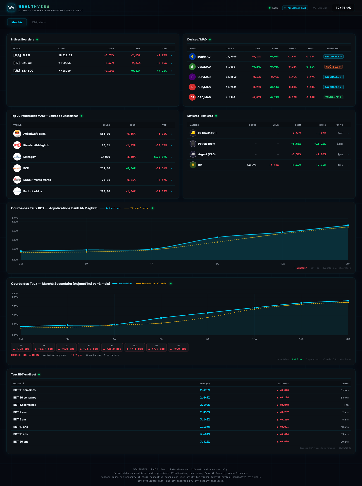

# WealthView

A real-time dashboard for Moroccan financial markets. It's one HTML file. No backend, no build step, no server cost. You open it in a browser and the data starts flowing in.

I built this because every dashboard I tried for Moroccan markets was either outdated, slow, or required a paid Bloomberg-like subscription. So I rolled my own.

**Live demo:** https://ak-ships.github.io/wealthview-demo/



## What it shows

**Marchés (Markets) tab**
* MASI, CAC 40, S&P 500
* Forex pairs vs. the Moroccan Dirham: EUR, USD, GBP, CHF, CAD
* Top 20 weighted equities on the Casablanca Stock Exchange with logos and live price flashes
* Commodities: Gold, Brent crude, Silver, Wheat
* Moroccan Treasury Bill (BDT) yield curve, broken down into primary auctions (Bank Al-Maghrib) and the secondary market
* Primary vs. secondary spread analysis, with a pressure/relief reading

**Obligations (Bonds) tab**
* Live BDT rates across 8 maturities (13w to 20y)
* Yield curve bar chart

Values flash cyan when they change. Each panel has its own little status indicator so you can tell at a glance whether it's live or running on cached data.

## How it works

```
TradingView WebSocket  (primary feed, same socket the tradingview.com charts use)
        │
        │ fails or rate-limited
        ▼
Yahoo Finance API  (15-min delayed, via free CORS proxies)
        │
        │ fails
        ▼
Static reference values baked into the page  (so the dashboard never shows blanks)
```

A small badge in the top-right tells you which source is currently active.

For Moroccan Treasury Bill rates, the dashboard tries bourse.ma and Bank Al-Maghrib via a CORS proxy first, and falls back to a snapshot of the latest published reference rates if those are blocked.

## Stack

| Layer | What it uses |
|---|---|
| Charts | Chart.js 4.4.6 (CDN, with 2 fallback CDNs) |
| Modal charts | TradingView Advanced Charting Library (`tv.js`) |
| Market data | TradingView Scanner WebSocket + Yahoo Finance |
| Moroccan rates | Bank Al-Maghrib and bourse.ma via [corsproxy.io](https://corsproxy.io) / [allorigins](https://allorigins.win) |
| Fonts | Inter, JetBrains Mono (Google Fonts) |
| Local launchers | Python `http.server` |

The whole app is one 3,200-line `index.html`. No `npm install`, no transpilation, no bundler. Open it in a browser and it works.

## Run it locally

**macOS**
```bash
./start.command          # or double-click in Finder
```

**Windows**
```
start.bat    (double-click)
```

**Linux**
```bash
bash start.sh
```

**Or just**
```bash
python3 -m http.server 8080
# then open http://localhost:8080
```

All the launcher scripts do is bootstrap a local Python `http.server` and open the browser for you.

## Public version vs. full version

This repo is the **public demo**. It started life as a more comprehensive internal tool for a private banking team. Several sections that were in the full version got removed before I published this, the biggest one being a live mutual fund (OPCVM) NAV tracking module that integrated with a specific Moroccan asset manager.

See [PUBLIC-VS-PRIVATE.md](PUBLIC-VS-PRIVATE.md) for the full list of what's in the public version, what isn't, and why.

The public version has:
* No internal company names, deployment context, or client data
* No proprietary fund lists or asset-manager integrations
* No internal user-facing documentation or employer references

All the data shown comes from public providers, fetched live at runtime.

## Disclaimer

This is a personal portfolio project. All market data is fetched from public sources at runtime, nothing is stored or transmitted. Company logos shown alongside ticker symbols belong to their respective trademark owners and are used purely for instrument identification (nominative fair use), the same convention Yahoo Finance, Bloomberg, MarketWatch, and TradingView use. WealthView is not affiliated with, endorsed by, or partnered with any displayed company, exchange, data provider, or financial institution.

Information shown is for informational purposes only and is not investment advice.

## License

MIT. See [LICENSE](LICENSE).
